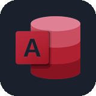

<!-- Banner -->

<!-- GIF Anime -->

  

# Halo! 👋 Saya Rendi Dwi Andika

Saya adalah mahasiswa **Bisnis Digital** yang berfokus pada **Data Analytics**. Saya memiliki minat yang kuat dalam merancang strategi bisnis berbasis data, mengelola *database*, dan membuat *dashboard* interaktif, khususnya untuk diterapkan pada sektor korporat dan finansial.

### 🛠️ Tech Stack & Tools

| | | | | | |
| :---: | :---: | :---: | :---: | :---: | :---: |
|  |  |  |  |  |  |
|  |  |  |  |  | |

### 📊 GitHub Stats

  

### 📫 Mari Terhubung!

  &nbsp;&nbsp;&nbsp;&nbsp;&nbsp; <!-- Spasi untuk geser ke kanan -->
  

### 👾 Pacman Contribution Game

  

