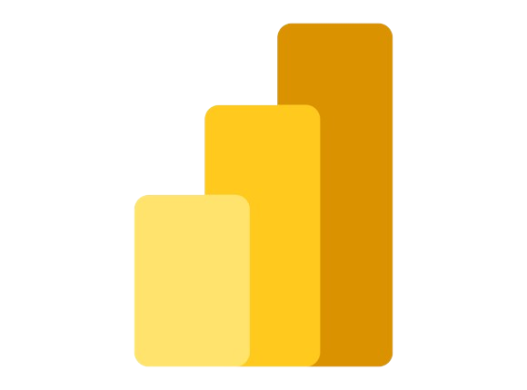
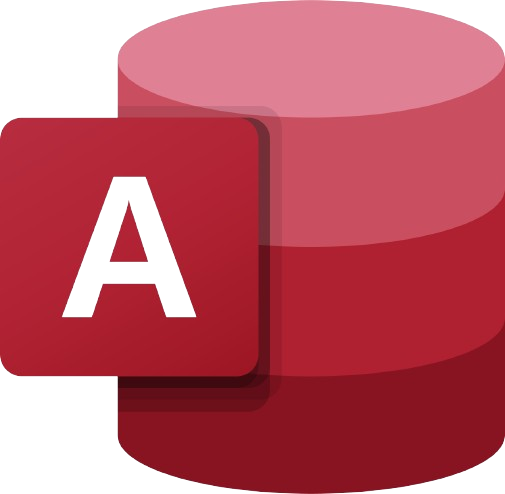
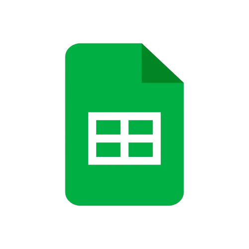

<!-- Banner -->

<!-- GIF Anime -->

  

# Halo! 👋 Saya Rendi Dwi Andika

Saya adalah mahasiswa **Bisnis Digital** yang berfokus pada **Data Analytics**. Saya memiliki minat yang kuat dalam merancang strategi bisnis berbasis data, mengelola *database*, dan membuat *dashboard* interaktif, khususnya untuk diterapkan pada sektor korporat dan finansial.

### 🛠️ Tech Stack & Tools

  <!-- Icon Developer & Database (Upload Manual) -->
   &nbsp;
   &nbsp;
   &nbsp;
   &nbsp;
   &nbsp;
   &nbsp;
    
  <!-- Icon Analisis & Office (Upload Manual) -->
   &nbsp;
   &nbsp;
   &nbsp;
   &nbsp;
   

### 📊 GitHub Stats

  

### 📫 Mari Terhubung!

  

### 👾 Pacman Contribution Game

  

